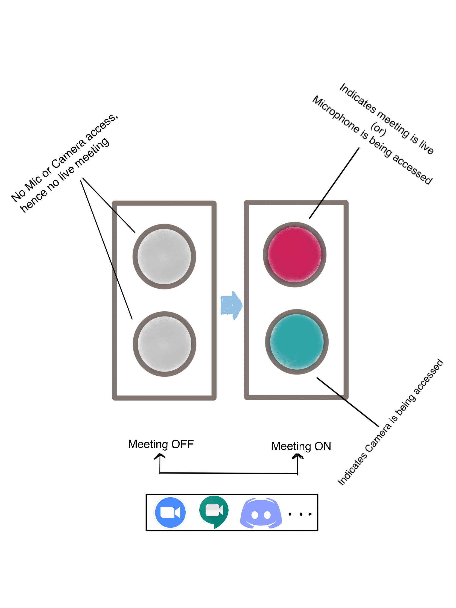
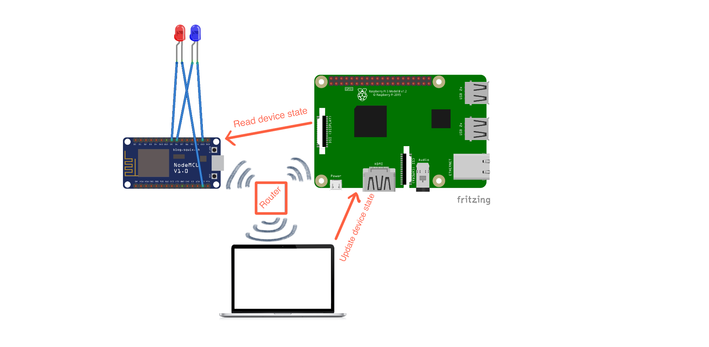
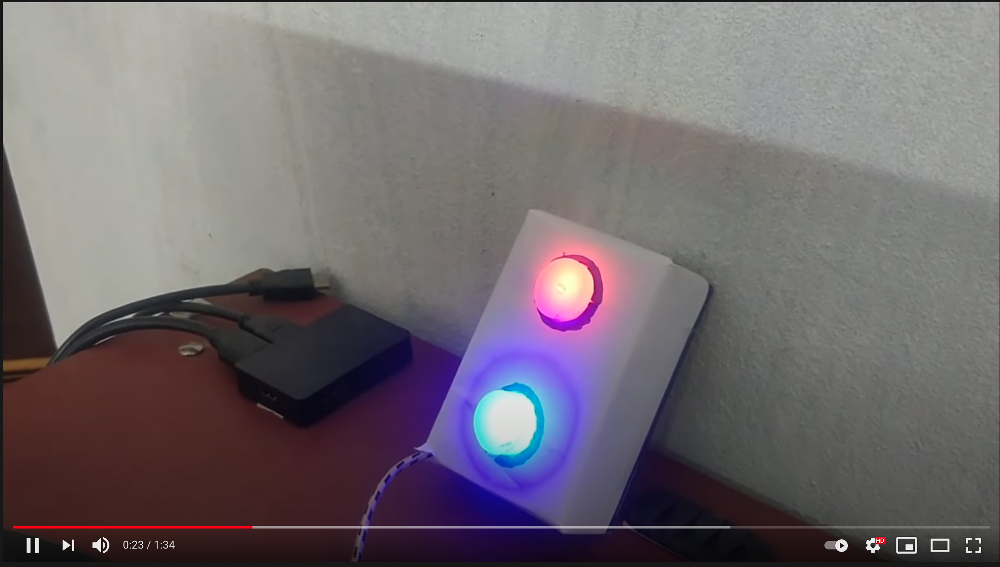
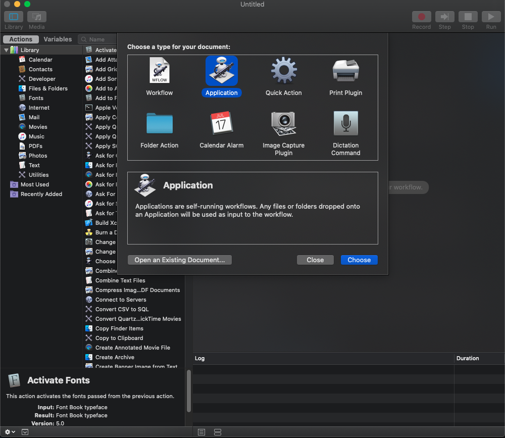
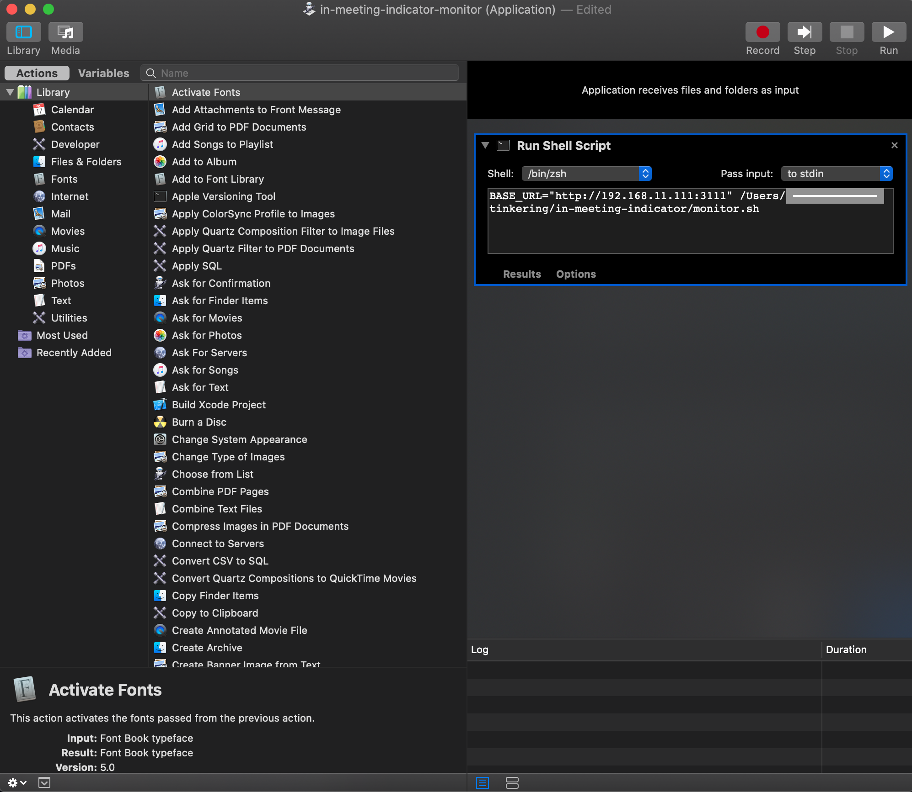
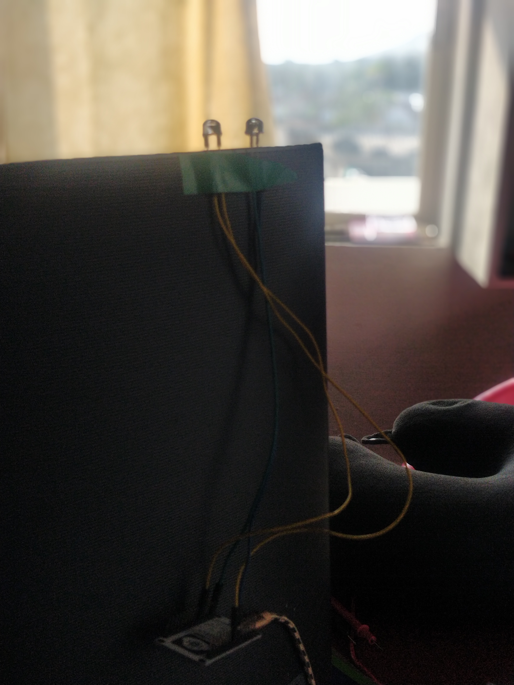

# DIY: In meeting indicator - WFH Utility

<em>The need for in meeting indicator at home</em>


So many of you have gotten accustomed to work from home by now. This pandemic has thrown a lot of challenges at our face when most of us are not ready for. While Work From Home is kind of boon, living with it for a long time comes with its own unique challenges. One of the simplest challenge I have faced in the initial days was to make my family understand that I am in a meeting where Mic/Camera/both are activated. It was becoming difficult sometimes to respond back to the family members for very trivial things while I am listening to a crucial conversation on zoom or trying to answer an important question on an ongoing video chat. Of course they understand that I am in work and it is difficult for me to respond. But these things can slowly be the trends at your home.

Gestures are great way to convey the same. But they don't always go smooth on the receiving side especially when you do them for visitors.

As a technologist, we should be able to tackle this better. 

- How about sending text messages to family members when you are on/off meeting(May be overwhelming)
- Share your calendar with family members? (How to deal with unscheduled ones?)
- Mobile app to show your availability(Too much of work?)
- **How about placing visual indicators at our desk? (Can be a Good starter)**

I have picked up the last idea out of all the above ones which seems doable with relatively little effort. Back to hardware mode.

**Outcome:**

<em>Goal of in meeting indicator</em>


Two simple LED light indicators of distinct colours, one for Microphone and another for Camera. Indicators turn on automatically based on your activity on your mac(picked up Mac as a starter) be it on Zoom, Meet, Discord or Facetime etc.

What do I need?

1. Majority of people use either one or two meeting applications on a daily basis. Check for developer documentation and find out whether they expose any apis to read Mic and Camera usage status.

    Unfortunately, I will not able to do this at least for zoom meetings when I last checked in their developer docs. Thats too disappointing to find out.

2. An app to detect Mic or Camera usage on your computer. 

    Doing this is not so easy especially to work with OS APIs. As I use Mac and I am no expert in OSX development. I am looking for some open source alternatives and found out a tool called "Oversight" from a security researcher Patrick Wardle. More about the tool [here](https://objective-see.com/products/oversight.html)

    Again unfortunate that I don't get any apis to query device status. But hold on, the tool writes the device status to a log file which I can scrape. Hoo yeah.

3. Two 10mm LED bulbs of different colours and jumper wire connectors which I can get from an online store.
4. I need a controller which has wifi support. I chose NodeMCU V2 for this.
5. I have a Raspberry Pi with on OLED display running in my living room all the time. I wanted to make this a central hub for any device communications within my home rather than my work laptop. 

    Idea was that my work laptop just updates device status to raspberry pi and NodeMCU queries it every few seconds and control the LED state accordingly. Later I also wanted to leverage this for my windows laptop, Mobile and tablet as well.


<em>Interaction diagram of nodeMCU, Raspberry Pi4 and Mac Laptop</em>
 

Here is a short demo video

[](https://www.youtube.com/watch?v=7trE5USEL08 "In Meeting Indicator Demo")

# On my Raspberry PI

To make things easy, I have assigned static IP to my Raspberry pi4 device based on its Mac address in my home router configuration. 

Written a simple Golang HTTP webserver with endpoints to query as well as update device status.

```go
package main

import(
	"net/http"
	"fmt"
	"nodemculistener/devicestate"
)

var devState *devicestate.Indicator

func main() {
	mux := http.NewServeMux()
	mux.HandleFunc("/mic", handleMicState)
	mux.HandleFunc("/camera", handleCameraState)
	mux.HandleFunc("/*", handleUnknown)

	setup()
	if err := http.ListenAndServe(":3000", mux); err != nil {
		fmt.Println("listen error: ", err.Error())
	}
}

func setup() {
	devState = devicestate.NewIndicator()
}

func handleMicState(rw http.ResponseWriter, r *http.Request) {
	if r.Method == http.MethodGet {
		fmt.Println("mic status", devState.IsMicEnabled())
		rw.Write([]byte(fmt.Sprintf("%v", devState.IsMicEnabled())))
	} else if r.Method == http.MethodPut {
		qParams := r.URL.Query()
		devState.SetMic(qParams.Get("state") == "on")
		rw.WriteHeader(http.StatusOK)
	} else {
		rw.WriteHeader(http.StatusBadRequest)
	}
}

func handleCameraState(rw http.ResponseWriter, r *http.Request) {
	if r.Method == http.MethodGet {
		fmt.Println("camera status", devState.IsMicEnabled())
		rw.Write([]byte(fmt.Sprintf("%v", devState.IsCameraEnabled())))
	} else if r.Method == http.MethodPut {
		qParams := r.URL.Query()
		devState.SetCamera(qParams.Get("state") == "on")
		rw.WriteHeader(http.StatusOK)
	} else {
		rw.WriteHeader(http.StatusBadRequest)
	}
}

func handleUnknown(rw http.ResponseWriter, r *http.Request) {
	fmt.Println("unknown req", r)
}
```

# On My Mac

Installed OverSight which starts writing log to a standard location. /System/Volumes/Data/Users/<UserName>/Library/Application Support/Objective-See/OverSight/OverSight.log

**There is a catch here:**

Oversight has an additional functionality which sends system tray notifications when device is activated or deactivated with information of the process like PID and name etc. The catch lies here, if you click on Allow on the notification (let's say for zoom process) badge, The process will be whitelisted by oversight and you will not further receive notifications and neither will write to log file for Zoom again.

To solve this, I have turned off notifications from the Mac system settings for Oversight application and also cleared all the whitelisted entries from Oversight application.

**Script to scrape OverSight logs and updates device status tp Web server running on Raspberry pi**

```bash
#!/bin/bash

echo "Base URL configured: $BASE_URL"

function updateMicStatus() {
	if [ $1 -eq 0 ]; then
		curl -X PUT "$BASE_URL/mic?state=on"
		echo "mic status updated to on"
	else
		curl -X PUT "$BASE_URL/mic?state=off"
		echo "mic status updated to off"
	fi
}

function updateCameraStatus() {
	if [ $1 -eq 0 ]; then
		curl -X PUT "$BASE_URL/camera?state=on"
		echo "camera status updated to on"
	else
		curl -X PUT "$BASE_URL/camera?state=off"
		echo "camera status updated to off"
	fi
}

cat "/System/Volumes/Data/Users/krishnak/Library/Application Support/Objective-See/OverSight/OverSight.log" | grep "Audio Device" | tail -n 1 | grep -q -w "active"
AUDIO_INIT_STATUS=$?
cat "/System/Volumes/Data/Users/krishnak/Library/Application Support/Objective-See/OverSight/OverSight.log" | grep "Video Device" | tail -n 1 | grep -q -w "active"
CAMERA_INIT_STATUS=$?

updateMicStatus $AUDIO_INIT_STATUS
updateCameraStatus $CAMERA_INIT_STATUS

tail -1f "/System/Volumes/Data/Users/krishnak/Library/Application Support/Objective-See/OverSight/OverSight.log" | awk '/Audio Device/ && /[^[:alpha:]]active/ { system("curl -X PUT $BASE_URL/mic?state=on") } /Audio Device/ && /inactive/ { system("curl -X PUT $BASE_URL/mic?state=off") }' &
tail -1f "/System/Volumes/Data/Users/krishnak/Library/Application Support/Objective-See/OverSight/OverSight.log" | awk '/Video Device/ && /[^[:alpha:]]active/ { system("curl -X PUT $BASE_URL/camera?state=on") } /Video Device/ && /inactive/ { system("curl -X PUT $BASE_URL/camera?state=off") }'
```

**Run the script from Mac automator as an application:**

```yaml
BASE_URL="http://192.168.11.111:3111" <Path To Folder>/monitor.sh
```

**Creating a automator application on Mac:**

Followed the process from here [https://michal.karzynski.pl/blog/2013/01/13/how-turn-shell-commands-mac-os-x-services/](https://michal.karzynski.pl/blog/2013/01/13/how-turn-shell-commands-mac-os-x-services/)





# On My NodeMCU

**NodeMCU program to listen to device state changes:**

```cpp
#include <Arduino.h>
#include <WiFiManager.h>
#include "RestClient.h"
#include <ESP8266HTTPClient.h>
#include "Config.h" //Keep your URL and SSID credentials in this

#define MICLED D5
#define CAMERALED D6

WiFiManager wifiManager;
String hostname;

int readMicStatus();
int readCameraStatus();
String getServerHostname();

void setup() {
  pinMode(MICLED, OUTPUT);
  pinMode(CAMERALED, OUTPUT);

  WiFi.mode(WIFI_STA); // explicitly set mode, esp defaults to STA+AP
  Serial.begin(9600);
  //reset settings - wipe credentials for testing
  //wm.resetSettings();

  // Automatically connect using saved credentials,
  // if connection fails, it starts an access point with the specified name ( "AutoConnectAP"),
  // if empty will auto generate SSID, if password is blank it will be anonymous AP (wm.autoConnect())
  // then goes into a blocking loop awaiting configuration and will return success result
	// wifiManager.setConfigPortalBlocking(false);

  if(!wifiManager.autoConnect(HOTSPOT_SSID, HOTSPOT_PWD)) {
        Serial.println("Failed to connect");
        delay(5000);
        ESP.restart();
  } else {
        //if you get here you have connected to the WiFi    
        Serial.println("connected...yeey :)");
  }
}

void loop() {
	// wifiManager.process();
  if (readMicStatus() == 1) {
    digitalWrite(MICLED, HIGH);
  } else {
    digitalWrite(MICLED, LOW);
  }

  if (readCameraStatus() == 1) {
    digitalWrite(CAMERALED, HIGH);
  } else {
    digitalWrite(CAMERALED, LOW);
  }

  delay(2000);
}

int readMicStatus() {
  int ret = -1;
  HTTPClient http;
  http.begin(MIC_ENDPOINT);
  int httpCode = http.GET();

  if (httpCode > 0) {
    String payload = http.getString();
    Serial.print("mic status: ");
    Serial.println(payload);
    if (payload == "true") {
      ret = 1;
    } else {
      ret = 0;
    }
  }
  http.end();
  return ret;
}

int readCameraStatus() {
  int ret = -1;
  HTTPClient http;
 
  http.begin(CAMERA_ENDPOINT);
  int httpCode = http.GET();

  if (httpCode > 0) {
    String payload = http.getString();
    Serial.print("camera status: ");
    Serial.println(payload);
    if (payload == "true") {
      ret = 1;
    } else {
      ret = 0;
    }
  }
  http.end();
  return ret;
}
```

**LED wiring:**

- Connect the two LED anodes(longer leg) to D5, D6 pins and grounds(shorter leg) to corresponding ground pins marked as GND of NodeMCU and that's it.

**WiFiManager library:**

When NodeMCU is not able to connect to your home router/hotspot for various reasons like SSID/password change. Instead of writing new SSID and password configuration by physically connecting and flashing NodeMCU with your computer, it turns on a Wifi Hotspot with pre defined SSID and allows you to connect via mobile/laptop and allows your add/correct router details. This library solves the most common problem of maintenance and I liked it.

**Config.h:**

Keep your URL and SSID credentials in a separate header file rather than in the code directly and don't forget to ignore it from git tracking. I placed these details in include/config.h file and included it in the main CPP file. This is one of the preferred and simplest approaches for maintaining secrets with CPP.

[**PlatformIO.org](http://platformio.org) IDE for IOT development:**

Arduino is a great IDE for programming NodeMCU boards. But it definitely lacks some things which a regular C++ IDE would have like

- Auto code completion
- Static code analysis
- Library manager
- Debugger
- Test framework

I personally found PlatformIO IDE solves these problems as well as supporting other existing features like inbuilt board management, serial plotter etc too.

**More Ideas/Coming Soon:**

- Trim Oversight code of additional functionality and do better integration
- Make an API call using Alexa skills/IFTTT to change colour of your smart bulb instead of LEDs
- Instead of using (Mac + NodeMCU + Raspberry Pi), this setup can be simplified by directly using either of wifi enabled NodeMCU or Raspberry Pi with your Mac as they both support GPIO pins for connecting LEDs.
- Send push notifications to your family members phones using services like Twilio/Pushbullet etc.

> **Note about VSCode extensions:**

> While I generally develop on mac but the actual code is sitting on my Raspberry pi SSD. I use a cool "Remote SSH" VSCode extension to access files over SSH connection on VSCode editor as if they were on your local machine.

> Moreover, VSCode is intelligent enough to let me choose my PlatformIDE extension to be installed on the Raspberry pi over SSH thus allowing Platform IDE to detect and work with connected devices on Raspberry pi natively. How cool is that.

Reference Links:

- [https://platformio.org/](https://platformio.org/)
- [https://marketplace.visualstudio.com/items?itemName=platformio.platformio-ide](https://marketplace.visualstudio.com/items?itemName=platformio.platformio-ide)
- [https://marketplace.visualstudio.com/items?itemName=ms-vscode-remote.remote-ssh](https://marketplace.visualstudio.com/items?itemName=ms-vscode-remote.remote-ssh)

---

[Patrick Wardle - OverSight: Exposing Spies on macos](https://youtu.be/5C0CPxwEAz8)

Disclaimer: Installing a third party tool like OverSight comes up with their own set of questions about security, privacy etc. This tool is open source and go see for yourself before you want to use it.


<em>Early Version: In Meeting indicator LEDs taped to the back of my external monitor</em>

